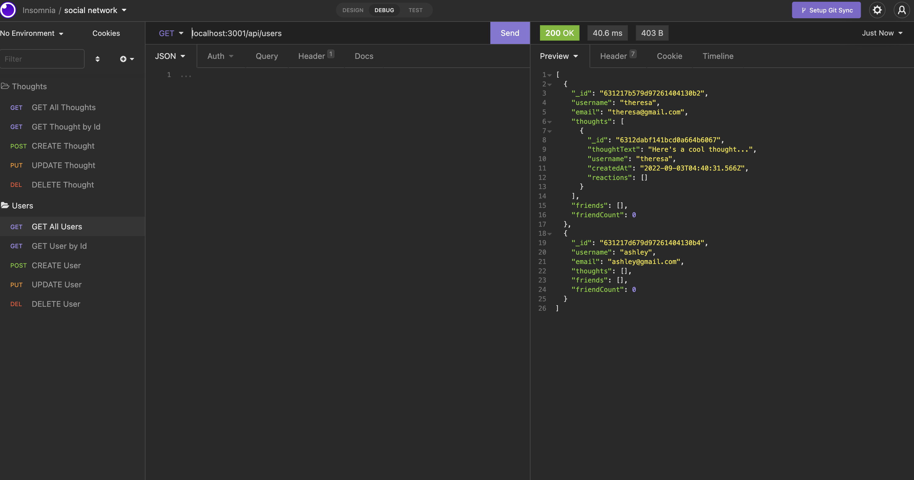

# Social Network

## Table of Contents

- [Description](#description)
- [User Story](#user-story)
- [Acceptance Criteria](#acceptance-criteria)
- [Installation](#installation)
- [Usage](#usage)
- [Contribution](#contribution)
- [Questions](#questions)

## Description

This is an API that I have built for a social network web application where users are able to share their thoughts, react to friends' thoughts, and create a friend list. Express.js and the MongoDB database were used in creating this API.

## User Story

```md
AS A social media startup
I WANT an API for my social network that uses a NoSQL database
SO THAT my website can handle large amounts of unstructured data
```

## Acceptance Criteria

```md
GIVEN a social network API
WHEN I enter the command to invoke the application
THEN my server is started and the Mongoose models are synced to the MongoDB database
WHEN I open API GET routes in Insomnia for users and thoughts
THEN the data for each of these routes is displayed in a formatted JSON
WHEN I test API POST, PUT, and DELETE routes in Insomnia
THEN I am able to successfully create, update, and delete users and thoughts in my database
WHEN I test API POST and DELETE routes in Insomnia
THEN I am able to successfully create and delete reactions to thoughts and add and remove friends to a user’s friend list
```

## Installation

```md
npm i
npm express
npm mongoose
```

## Usage




GitHub Repo: https://github.com/Theresa2013/social-network.git

## Contribution

If you are interested in future development, please reach me via email or Github!

## Questions

If you have any questions, please feel free to reach out!

Github username: Theresa2013

Github Email: tab61295@gmail.com
